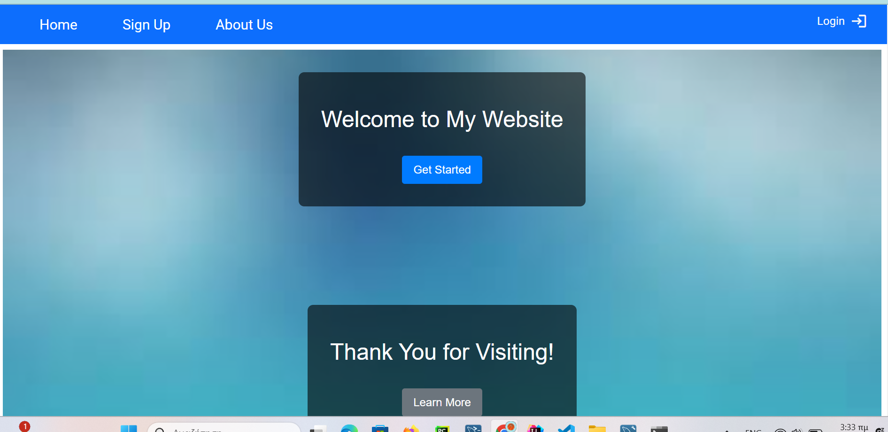
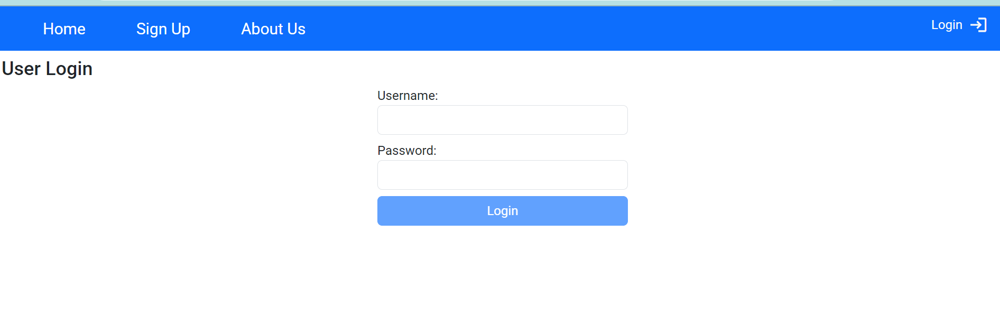
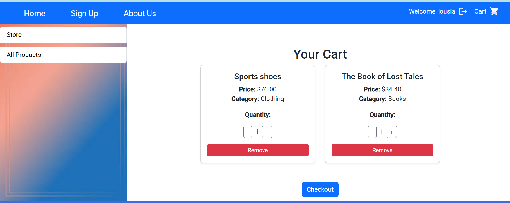
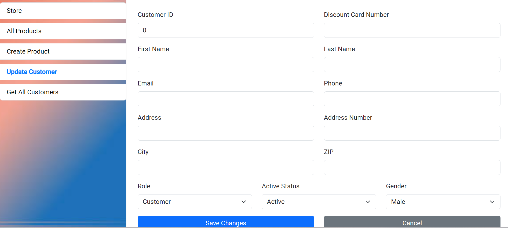

# E-commerce Frontend (Angular)

## Overview
This project is the frontend application of an e-commerce platform built with Angular.

It communicates with a Spring Boot backend through REST APIs and provides the user interface for authentication, product browsing, and other core application features.

---

## Technologies
- Angular
- TypeScript
- HTML
- CSS
- REST API integration

---

## Features
- User login and authentication
- Product browsing
- Communication with backend REST APIs (Spring Boot)
- Structured and responsive user interface

---

## Project Structure
The frontend is organized into Angular components and services to keep the application modular and maintainable.

- **Components** → Handle the user interface
- **Services** → Handle API communication and business-related frontend logic
- **Routing** → Manages navigation between application views

---

## Getting Started

### Prerequisites
- Node.js
- npm
- Angular CLI

---

### Install dependencies

```bash
npm install

```

### Run the application
```bash
ng serve

```

### Access the Application
http://localhost:4200

---

### Backend Dependency
This frontend application requires the backend service to be running in order to access authentication, products, and other API-based functionality.

Backend repository: https://github.com/dimisysk/e-commerce

---

### Notes
This project is intended for demonstration and learning purposes.
Some UI flows and integrations are designed for local development and portfolio presentation.

---

## Future Improvements

- Improve UI/UX consistency
- Add more robust form validation
- Improve error handling and user feedback
- Add unit and integration tests


## Screenshots

### Home Page


---

### Authentication

#### Login


#### Register


---

### Product Browsing & Filtering


---

### Shopping Cart


---

### Admin Panel

#### Customer Management (Table View)


#### Update Customer (Form)


---

### Product Management

#### Create Product
